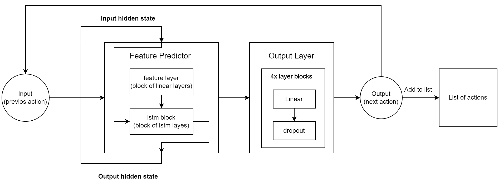
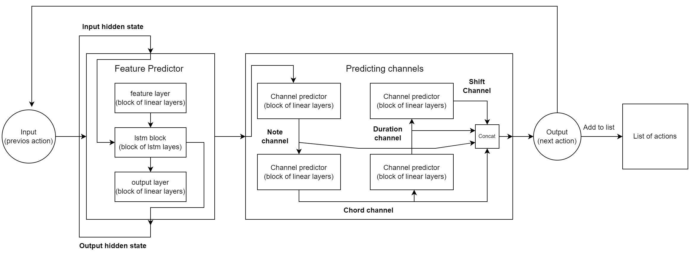
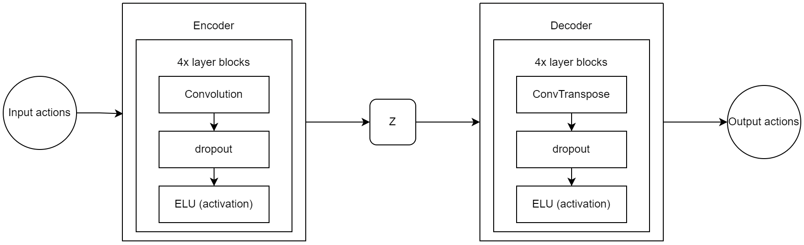

# Music generation
This is my school project on big data for the 10th grade.  
The goal of the project is to create a neural network for music generation.  
The dataset I am using is [GiantMIDI-Piano](https://github.com/bytedance/GiantMIDI-Piano).

## Neural network architecture diagram
### RNN architecture:
  
### GAN architecture:
  
### VAE architecture:
  
## Generated music by
- ### [RNN](https://github.com/DenisIndenbom/music_generation/raw/master/best_generated/RNN)
- ### [GAN](https://github.com/DenisIndenbom/music_generation/raw/master/best_generated/GAN)
- ### [VAE](https://github.com/DenisIndenbom/music_generation/raw/master/best_generated/VAE)
